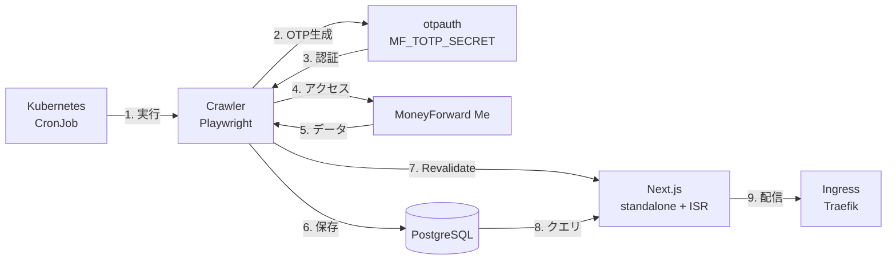

<div align="center">
  
  <h1>MoneyForward Me Dashboard</h1>
  <p>MoneyForward Meを自動化、可視化</p>
</div>

> [!NOTE]
> This is a fork of [hiroppy/mf-dashboard](https://github.com/hiroppy/mf-dashboard).
> オリジナルは GitHub Actions + 1Password + SQLite + Cloudflare Pages 構成ですが、本フォークでは Kubernetes + PostgreSQL + On-demand ISR 構成に移行しています。

## 機能

### 指定した時間に金融機関の一括更新

Kubernetes CronJob で定期的に実行し、登録金融機関の「一括更新」ボタンを押し監視を行う。デフォルトの設定は、毎日 6:50(JST) と 15:20(JST)。

### Slackへ結果を投稿

Slack botの設定をすることにより、前日との差分を投稿可能。


### 自分の行いたい処理を実行

hookが提供されているので、スクレイピング時に用意したスクリプトを実行可能。例えば、特定の金融機関の取引の場合に大項目、中項目を常に食品に設定する等。Playwrightの`Page`を持っているので基本何でもできる。

### すべての情報を可視化

[demoページ](https://hiroppy.github.io/mf-dashboard/accounts/)を参考。予算機能以外はすべて対応済み。


## 導入方法

[使い方ページ](/docs/setup.md)を参照

## アーキテクチャ

Kubernetes 上で CronJob により定期的に MoneyForward Me のデータを取得し、PostgreSQL に保存。Next.js (standalone + ISR) でダッシュボードを配信する。



**処理の流れ:**

- **定期実行**: Kubernetes CronJob のスケジュールで自動実行
- **認証**: 環境変数の TOTP シークレットから OTP を生成してログイン
- **データ取得**: Playwright を使用して MoneyForward Me からデータをスクレイピング
- **データ保存**: PostgreSQL データベースに構造化して保存
- **キャッシュ無効化**: `POST /api/revalidate` で Next.js の ISR キャッシュを即時更新
- **Slack 通知**: 更新結果を Slack に投稿（オプション）

## 開発

```sh
git clone <repo-url>
cd mf-dashboard
pnpm i

# PostgreSQL を起動
docker compose up -d db

# 開発サーバー起動
pnpm dev
```

詳細は [セットアップガイド](/docs/setup.md) を参照。
