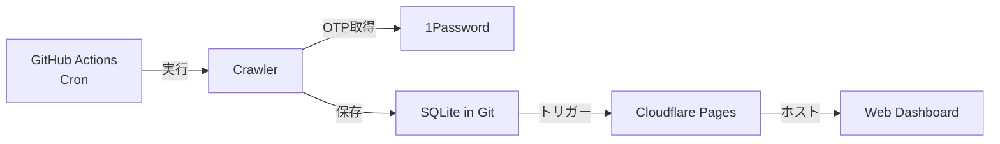
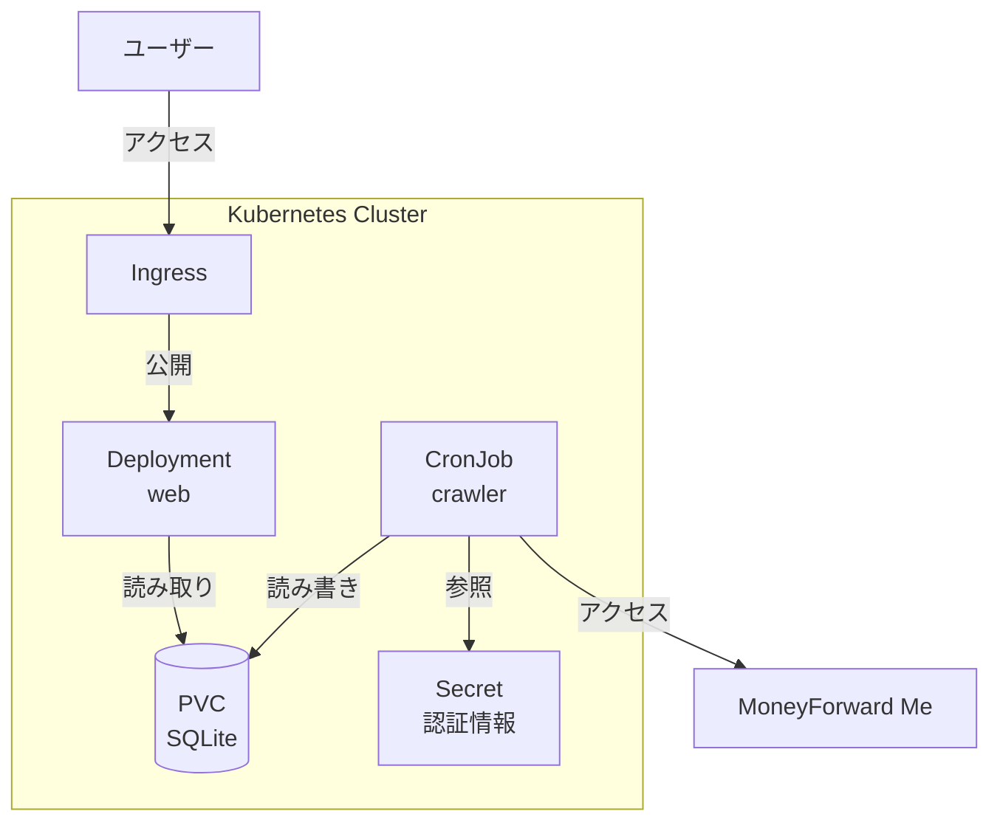

# Kubernetes 移行計画

## 概要

本ドキュメントは、MoneyForward Me Dashboard を現行の GitHub Actions + 1Password + Cloudflare 構成から、完全に Kubernetes 上で動作する構成への移行計画を記述します。

---

## 目次

1. [移行の目的](#移行の目的)
2. [現行アーキテクチャと課題](#現行アーキテクチャと課題)
3. [移行後アーキテクチャ](#移行後アーキテクチャ)
4. [変更対象コンポーネント](#変更対象コンポーネント)
5. [詳細設計](#詳細設計)
6. [実装フェーズ](#実装フェーズ)
7. [動作検証](#動作検証)
8. [移行チェックリスト](#移行チェックリスト)

---

## 移行の目的

| 項目               | 現行                     | 移行後                       |
| ------------------ | ------------------------ | ---------------------------- |
| 定期実行           | GitHub Actions cron      | Kubernetes CronJob           |
| 認証情報管理       | 1Password Service Account | Kubernetes Secret            |
| Web ホスティング   | Cloudflare Pages         | Kubernetes Deployment + Ingress |
| データベース       | Git リポジトリ内 SQLite  | PersistentVolume 上の SQLite |

**メリット:**

- 外部サービス依存の削減
- インフラの一元管理
- プライベートクラスタ内での完結
- 柔軟なスケジューリングと監視

---

## 現行アーキテクチャ

### 現行構成



---

## 移行後アーキテクチャ

### 新構成



### コンポーネント構成

| リソース種別     | 名前                  | 役割                           |
| ---------------- | --------------------- | ------------------------------ |
| CronJob          | `mf-crawler`          | 定期スクレイピング実行         |
| Deployment       | `mf-web`              | Next.js ダッシュボード提供     |
| PersistentVolumeClaim | `mf-data`        | SQLite データベース永続化      |
| Secret           | `mf-credentials`      | MoneyForward 認証情報          |
| ConfigMap        | `mf-config`           | 環境設定（スケジュール等）     |
| Ingress          | `mf-ingress`          | 外部公開（認証付き）           |
| Service          | `mf-web`              | Web Pod への内部アクセス       |

---

## 変更対象コンポーネント

### 1. apps/crawler

#### 1.1 認証情報取得の変更

**現行:** 1Password SDK を使用

```typescript
// apps/crawler/src/auth/credentials.ts
import { createClient } from "@1password/sdk";
```

**変更後:** 環境変数から直接取得

```typescript
// 環境変数から認証情報を取得
export function getCredentials() {
  const username = process.env.MF_USERNAME;
  const password = process.env.MF_PASSWORD;
  if (!username || !password) {
    throw new Error("MF_USERNAME and MF_PASSWORD are required");
  }
  return { username, password };
}
```

#### 1.2 OTP 取得の変更

**現行:** 1Password から TOTP を取得

**変更後:** 

- TOTP シークレットを Kubernetes Secret に保存
- `otpauth` パッケージで TOTP を生成
- 認証状態を PVC に永続化してセッション再利用

```typescript
// TOTP 生成（otpauth パッケージ使用）
import { TOTP } from "otpauth";

export function getOTP(): string {
  const secret = process.env.MF_TOTP_SECRET;
  if (!secret) throw new Error("MF_TOTP_SECRET is required");
  
  const totp = new TOTP({
    secret: secret,
    algorithm: "SHA1",
    digits: 6,
    period: 30,
  });
  return totp.generate();
}
```

#### 1.3 データベースパスの変更

**現行:** `data/moneyforward.db`（Git リポジトリ内）

**変更後:** `/data/moneyforward.db`（PVC マウントパス）

```typescript
// 環境変数で設定可能に
const DB_PATH = process.env.DB_PATH || "/data/moneyforward.db";
```

#### 1.4 依存関係の変更

**削除:**
- `@1password/sdk`

**追加:**
- `otpauth` (TOTP 生成用)

---

### 2. apps/web

#### 2.1 実行モードの変更

**現行:** Static Export → Cloudflare Pages

**変更後:** Node.js サーバーモード → Kubernetes Deployment

```typescript
// next.config.ts
const config: NextConfig = {
  // output: "export" を削除（サーバーモードに変更）
  // または standalone モードで軽量コンテナ化
  output: "standalone",
};
```

#### 2.2 データベースパスの変更

**現行:** ビルド時に `data/moneyforward.db` を参照

**変更後:** 実行時に PVC マウントパスを参照

```typescript
const DB_PATH = process.env.DB_PATH || "/data/moneyforward.db";
```

---

### 3. 新規作成: Helm Chart

#### ディレクトリ構成

```
charts/mf-dashboard/
├── Chart.yaml
├── values.yaml
├── templates/
│   ├── _helpers.tpl
│   ├── pvc.yaml
│   ├── secret.yaml           # ExternalSecret または直接 Secret
│   ├── configmap.yaml
│   ├── cronjob.yaml
│   ├── deployment.yaml
│   ├── service.yaml
│   └── ingress.yaml
└── README.md
```

---

## 詳細設計

### 5.1 Chart.yaml

```yaml
apiVersion: v2
name: mf-dashboard
description: MoneyForward Me Dashboard - 家計管理ダッシュボード
type: application
version: 0.1.0
appVersion: "1.0.0"
```

### 5.2 values.yaml

```yaml
# 共通設定
nameOverride: ""
fullnameOverride: ""

# イメージ設定
crawler:
  image:
    repository: <registry>/mf-crawler
    tag: latest
    pullPolicy: IfNotPresent
  resources:
    requests:
      memory: "512Mi"
      cpu: "250m"
    limits:
      memory: "2Gi"
      cpu: "1000m"

web:
  image:
    repository: <registry>/mf-web
    tag: latest
    pullPolicy: IfNotPresent
  replicaCount: 1
  resources:
    requests:
      memory: "128Mi"
      cpu: "100m"
    limits:
      memory: "512Mi"
      cpu: "500m"

# CronJob 設定
cronjob:
  schedules:
    - "50 21 * * *"    # JST 6:50
    - "20 6 * * *"     # JST 15:20
  concurrencyPolicy: Forbid
  successfulJobsHistoryLimit: 3
  failedJobsHistoryLimit: 3
  backoffLimit: 2

# 永続化設定
persistence:
  enabled: true
  storageClassName: ""
  accessMode: ReadWriteOnce
  size: 1Gi
  # 既存の PVC を使用する場合
  existingClaim: ""

# 認証情報
credentials:
  # 既存の Secret を使用する場合
  existingSecret: ""
  # 新規作成する場合（values で指定は非推奨、--set で渡す）
  mfUsername: ""
  mfPassword: ""
  mfTotpSecret: ""

# Slack 通知（オプション）
slack:
  enabled: false
  botToken: ""
  channelId: ""

# Ingress 設定
ingress:
  enabled: true
  className: nginx
  annotations: {}
    # nginx.ingress.kubernetes.io/auth-url: "https://oauth2.example.com/oauth2/auth"
    # nginx.ingress.kubernetes.io/auth-signin: "https://oauth2.example.com/oauth2/start"
  hosts:
    - host: mf-dashboard.example.com
      paths:
        - path: /
          pathType: Prefix
  tls:
    - secretName: mf-tls
      hosts:
        - mf-dashboard.example.com

# Service 設定
service:
  type: ClusterIP
  port: 80

# Pod Affinity（PVC 共有のため同一ノードに配置）
affinity:
  podAffinity:
    requiredDuringSchedulingIgnoredDuringExecution:
      - labelSelector:
          matchLabels:
            app.kubernetes.io/name: mf-dashboard
        topologyKey: kubernetes.io/hostname
```

### 5.3 templates/pvc.yaml

```yaml
{{- if and .Values.persistence.enabled (not .Values.persistence.existingClaim) }}
apiVersion: v1
kind: PersistentVolumeClaim
metadata:
  name: {{ include "mf-dashboard.fullname" . }}-data
  labels:
    {{- include "mf-dashboard.labels" . | nindent 4 }}
spec:
  accessModes:
    - {{ .Values.persistence.accessMode }}
  resources:
    requests:
      storage: {{ .Values.persistence.size }}
  {{- if .Values.persistence.storageClassName }}
  storageClassName: {{ .Values.persistence.storageClassName }}
  {{- end }}
{{- end }}
```

> [!WARNING]
> `ReadWriteOnce` の場合、同一ノードでのみ複数 Pod から同時アクセス可能。
> `affinity` 設定で Pod が同一ノードにスケジュールされるよう制御。

### 5.4 templates/secret.yaml

```yaml
{{- if not .Values.credentials.existingSecret }}
apiVersion: v1
kind: Secret
metadata:
  name: {{ include "mf-dashboard.fullname" . }}-credentials
  labels:
    {{- include "mf-dashboard.labels" . | nindent 4 }}
type: Opaque
stringData:
  MF_USERNAME: {{ .Values.credentials.mfUsername | quote }}
  MF_PASSWORD: {{ .Values.credentials.mfPassword | quote }}
  MF_TOTP_SECRET: {{ .Values.credentials.mfTotpSecret | quote }}
  {{- if .Values.slack.enabled }}
  SLACK_BOT_TOKEN: {{ .Values.slack.botToken | quote }}
  SLACK_CHANNEL_ID: {{ .Values.slack.channelId | quote }}
  {{- end }}
{{- end }}
```

> [!TIP]
> 実運用では External Secrets Operator や Sealed Secrets の利用を推奨。
> `credentials.existingSecret` で既存 Secret を参照可能。

### 5.5 templates/cronjob.yaml

```yaml
{{- range $index, $schedule := .Values.cronjob.schedules }}
---
apiVersion: batch/v1
kind: CronJob
metadata:
  name: {{ include "mf-dashboard.fullname" $ }}-crawler-{{ $index }}
  labels:
    {{- include "mf-dashboard.labels" $ | nindent 4 }}
    app.kubernetes.io/component: crawler
spec:
  schedule: {{ $schedule | quote }}
  concurrencyPolicy: {{ $.Values.cronjob.concurrencyPolicy }}
  successfulJobsHistoryLimit: {{ $.Values.cronjob.successfulJobsHistoryLimit }}
  failedJobsHistoryLimit: {{ $.Values.cronjob.failedJobsHistoryLimit }}
  jobTemplate:
    spec:
      backoffLimit: {{ $.Values.cronjob.backoffLimit }}
      template:
        metadata:
          labels:
            {{- include "mf-dashboard.labels" $ | nindent 12 }}
            app.kubernetes.io/component: crawler
        spec:
          restartPolicy: OnFailure
          {{- with $.Values.affinity }}
          affinity:
            {{- toYaml . | nindent 12 }}
          {{- end }}
          containers:
            - name: crawler
              image: "{{ $.Values.crawler.image.repository }}:{{ $.Values.crawler.image.tag }}"
              imagePullPolicy: {{ $.Values.crawler.image.pullPolicy }}
              envFrom:
                - secretRef:
                    name: {{ $.Values.credentials.existingSecret | default (printf "%s-credentials" (include "mf-dashboard.fullname" $)) }}
              env:
                - name: DB_PATH
                  value: /data/moneyforward.db
              volumeMounts:
                - name: data
                  mountPath: /data
              resources:
                {{- toYaml $.Values.crawler.resources | nindent 16 }}
          volumes:
            - name: data
              persistentVolumeClaim:
                claimName: {{ $.Values.persistence.existingClaim | default (printf "%s-data" (include "mf-dashboard.fullname" $)) }}
{{- end }}
```

### 5.6 templates/deployment.yaml

```yaml
apiVersion: apps/v1
kind: Deployment
metadata:
  name: {{ include "mf-dashboard.fullname" . }}-web
  labels:
    {{- include "mf-dashboard.labels" . | nindent 4 }}
    app.kubernetes.io/component: web
spec:
  replicas: {{ .Values.web.replicaCount }}
  selector:
    matchLabels:
      {{- include "mf-dashboard.selectorLabels" . | nindent 6 }}
      app.kubernetes.io/component: web
  template:
    metadata:
      labels:
        {{- include "mf-dashboard.labels" . | nindent 8 }}
        app.kubernetes.io/component: web
    spec:
      {{- with .Values.affinity }}
      affinity:
        {{- toYaml . | nindent 8 }}
      {{- end }}
      containers:
        - name: web
          image: "{{ .Values.web.image.repository }}:{{ .Values.web.image.tag }}"
          imagePullPolicy: {{ .Values.web.image.pullPolicy }}
          ports:
            - name: http
              containerPort: 3000
              protocol: TCP
          env:
            - name: DB_PATH
              value: /data/moneyforward.db
          volumeMounts:
            - name: data
              mountPath: /data
              readOnly: true
          livenessProbe:
            httpGet:
              path: /
              port: http
            initialDelaySeconds: 10
          readinessProbe:
            httpGet:
              path: /
              port: http
            initialDelaySeconds: 5
          resources:
            {{- toYaml .Values.web.resources | nindent 12 }}
      volumes:
        - name: data
          persistentVolumeClaim:
            claimName: {{ .Values.persistence.existingClaim | default (printf "%s-data" (include "mf-dashboard.fullname" .)) }}
```

### 5.7 templates/service.yaml

```yaml
apiVersion: v1
kind: Service
metadata:
  name: {{ include "mf-dashboard.fullname" . }}-web
  labels:
    {{- include "mf-dashboard.labels" . | nindent 4 }}
spec:
  type: {{ .Values.service.type }}
  ports:
    - port: {{ .Values.service.port }}
      targetPort: http
      protocol: TCP
      name: http
  selector:
    {{- include "mf-dashboard.selectorLabels" . | nindent 4 }}
    app.kubernetes.io/component: web
```

### 5.8 templates/ingress.yaml

```yaml
{{- if .Values.ingress.enabled -}}
apiVersion: networking.k8s.io/v1
kind: Ingress
metadata:
  name: {{ include "mf-dashboard.fullname" . }}
  labels:
    {{- include "mf-dashboard.labels" . | nindent 4 }}
  {{- with .Values.ingress.annotations }}
  annotations:
    {{- toYaml . | nindent 4 }}
  {{- end }}
spec:
  {{- if .Values.ingress.className }}
  ingressClassName: {{ .Values.ingress.className }}
  {{- end }}
  {{- if .Values.ingress.tls }}
  tls:
    {{- range .Values.ingress.tls }}
    - hosts:
        {{- range .hosts }}
        - {{ . | quote }}
        {{- end }}
      secretName: {{ .secretName }}
    {{- end }}
  {{- end }}
  rules:
    {{- range .Values.ingress.hosts }}
    - host: {{ .host | quote }}
      http:
        paths:
          {{- range .paths }}
          - path: {{ .path }}
            pathType: {{ .pathType }}
            backend:
              service:
                name: {{ include "mf-dashboard.fullname" $ }}-web
                port:
                  number: {{ $.Values.service.port }}
          {{- end }}
    {{- end }}
{{- end }}
```

### 5.9 インストールコマンド

```bash
# 開発環境へインストール
helm install mf-dashboard ./charts/mf-dashboard \
  --namespace mf-dashboard \
  --create-namespace \
  --set credentials.mfUsername="your-email@example.com" \
  --set credentials.mfPassword="your-password" \
  --set credentials.mfTotpSecret="your-totp-secret"

# values ファイルを使用
helm install mf-dashboard ./charts/mf-dashboard \
  --namespace mf-dashboard \
  --create-namespace \
  -f values-prod.yaml

# アップグレード
helm upgrade mf-dashboard ./charts/mf-dashboard \
  --namespace mf-dashboard \
  -f values-prod.yaml

# アンインストール
helm uninstall mf-dashboard --namespace mf-dashboard
```

### 5.7 Docker イメージ

#### Crawler Dockerfile

```dockerfile
FROM mcr.microsoft.com/playwright:v1.48.0-noble

WORKDIR /app

# Install pnpm
RUN corepack enable pnpm

# Copy package files
COPY package.json pnpm-lock.yaml pnpm-workspace.yaml ./
COPY apps/crawler/package.json apps/crawler/
COPY packages/db/package.json packages/db/
COPY packages/meta/package.json packages/meta/

# Install dependencies
RUN pnpm install --frozen-lockfile

# Copy source
COPY apps/crawler apps/crawler
COPY packages/db packages/db
COPY packages/meta packages/meta
COPY tsconfig.json ./

# Build
RUN pnpm --filter @moneyforward-daily-action/crawler build

CMD ["pnpm", "--filter", "@moneyforward-daily-action/crawler", "start"]
```

#### Web Dockerfile

```dockerfile
FROM node:22-alpine AS base

# Install pnpm
RUN corepack enable pnpm

FROM base AS builder
WORKDIR /app

COPY package.json pnpm-lock.yaml pnpm-workspace.yaml ./
COPY apps/web/package.json apps/web/
COPY packages/db/package.json packages/db/
COPY packages/meta/package.json packages/meta/

RUN pnpm install --frozen-lockfile

COPY apps/web apps/web
COPY packages/db packages/db
COPY packages/meta packages/meta
COPY tsconfig.json ./

# Standalone build
RUN pnpm --filter @moneyforward-daily-action/web build

FROM base AS runner
WORKDIR /app

ENV NODE_ENV=production

# Copy standalone output
COPY --from=builder /app/apps/web/.next/standalone ./
COPY --from=builder /app/apps/web/.next/static ./apps/web/.next/static
COPY --from=builder /app/apps/web/public ./apps/web/public

EXPOSE 3000

CMD ["node", "apps/web/server.js"]
```

---

## 実装フェーズ

### Phase 1: 認証ロジックの変更

1. `apps/crawler/src/auth/credentials.ts` を環境変数ベースに変更
2. `otpauth` パッケージを追加して TOTP 生成を実装
3. `@1password/sdk` 依存を削除
4. ローカルで動作確認

### Phase 2: データベースパスの外部化

1. `packages/db` の DB パスを環境変数で設定可能に変更
2. `apps/crawler` と `apps/web` で環境変数を使用するよう変更

### Phase 3: Docker イメージ作成

1. Crawler 用 Dockerfile 作成
2. Web 用 Dockerfile 作成
3. ローカルでビルド・動作確認

### Phase 4: Helm Chart 作成

1. `charts/mf-dashboard/` ディレクトリ構成作成
2. `Chart.yaml`, `values.yaml` 作成
3. 各テンプレートファイル作成

### Phase 5: デプロイと検証

1. 開発クラスタへデプロイ
2. CronJob の手動実行テスト
3. Web ダッシュボードの動作確認
4. エンドツーエンドテスト

### Phase 6: 本番移行

1. 本番クラスタへデプロイ
2. 既存データの移行（SQLite ファイルコピー）
3. Ingress 設定と DNS 更新

---

## 動作検証

### 検証項目

| 項目                         | 検証方法                                       |
| ---------------------------- | ---------------------------------------------- |
| CronJob 実行                 | `kubectl create job --from=cronjob/mf-crawler test` |
| 認証成功                     | Pod ログで「Login successful!」確認           |
| DB 書き込み                  | PVC 内の SQLite ファイル更新確認               |
| Web 表示                     | ブラウザで Ingress URL にアクセス              |
| データ反映                   | CronJob 実行後、Web ダッシュボードで最新データ確認 |
| Slack 通知（オプション）     | Slack チャンネルで通知確認                     |

### ログ確認コマンド

```bash
# CronJob 実行状況
kubectl get jobs -l app=mf-crawler

# Pod ログ確認
kubectl logs -l job-name=mf-crawler-xxxxx

# Web Pod ログ
kubectl logs -l app=mf-web
```

---

## 移行チェックリスト

- [ ] 認証ロジック変更（1Password SDK 削除、環境変数化）
- [ ] TOTP 生成実装（otpauth パッケージ）
- [ ] DB パス環境変数化
- [ ] Crawler Dockerfile 作成
- [ ] Web Dockerfile 作成
- [ ] Docker イメージビルド確認
- [ ] Helm Chart 作成
- [ ] 開発環境デプロイ
- [ ] CronJob 手動実行テスト
- [ ] Web ダッシュボード動作確認
- [ ] 本番環境デプロイ
- [ ] 既存データ移行
- [ ] DNS/Ingress 設定
- [ ] GitHub Actions 無効化
- [ ] Cloudflare Pages 無効化
- [ ] 監視・アラート設定

---

## 注意事項

> [!IMPORTANT]
> - TOTP シークレットは MoneyForward の 2FA 設定時に表示される Base32 文字列
> - 既存の 2FA を再設定する必要があるため、一時的にログインできなくなる可能性あり
> - 移行前に必ず認証情報のバックアップを取得

> [!CAUTION]
> - SQLite は同時書き込みに制限があるため、CronJob と Web の同時アクセスに注意
> - `ReadWriteOnce` PVC では Pod が異なるノードにスケジュールされると問題発生
> - Playwright コンテナはメモリ使用量が大きいため、リソース制限の設定を推奨
