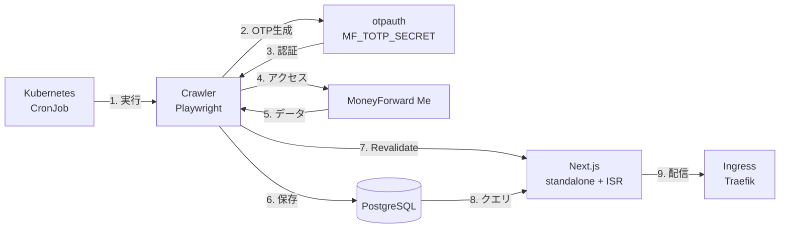
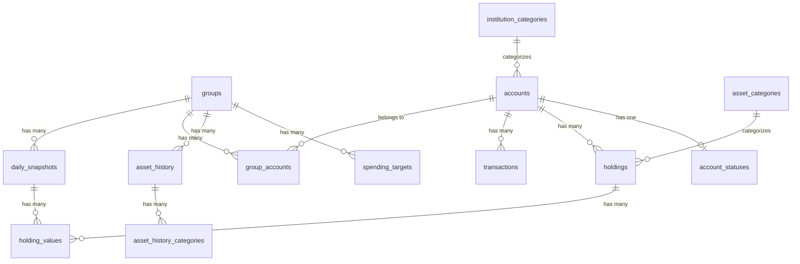

# MoneyForward Me Dashboard 仕様書

## 概要

MoneyForward Me Dashboard は、MoneyForward Me からデータを自動取得し、PostgreSQL データベースに保存、Web ダッシュボードとして可視化を行うためのシステムです。Kubernetes 上で CronJob による定期実行と Next.js (standalone) によるサーバーサイドレンダリングを組み合わせ、完全に自動化された家計管理ダッシュボードを提供します。

---

## 目次

1. [主要機能](#主要機能)
2. [アーキテクチャ](#アーキテクチャ)
3. [プロジェクト構成](#プロジェクト構成)
4. [パッケージ詳細](#パッケージ詳細)
5. [データベーススキーマ](#データベーススキーマ)
6. [スクレイピング処理](#スクレイピング処理)
7. [Web ダッシュボード](#web-ダッシュボード)
8. [CI](#ci)
9. [環境変数・設定](#環境変数設定)
10. [開発ガイドライン](#開発ガイドライン)
11. [セキュリティ](#セキュリティ)

---

## 主要機能

### 1. 定期自動更新

- Kubernetes CronJob で毎日 2 回自動実行（JST 6:50 および 15:20）
- MoneyForward Me の「一括更新」ボタンを自動クリックし、全登録金融機関のデータを更新
- 環境変数（`MF_USERNAME` / `MF_PASSWORD` / `MF_TOTP_SECRET`）による認証情報管理
- `otpauth` ライブラリによる TOTP ワンタイムパスワード生成

### 2. On-demand ISR

- スクレイピング完了後、`POST /api/revalidate` を呼び出してキャッシュを即時無効化
- フォールバックとして 1 時間ごとの時間ベース revalidation を設定

### 3. Slack 通知

- 更新結果を Slack チャンネルに自動投稿
- 前日との差分情報を含む

### 4. カスタムフック

- スクレイピング時に任意の処理を実行可能
- Playwright の `Page` オブジェクトを利用した柔軟なカスタマイズ

### 5. データ可視化

- 資産推移グラフ
- 収支内訳（カテゴリ別）
- ポートフォリオ分析
- 口座別資産状況
- キャッシュフロー分析
- バランスシート表示

---

## アーキテクチャ



### 処理の流れ

1. **定期実行**: Kubernetes CronJob のスケジュールで自動実行
2. **認証**: 環境変数の TOTP シークレットから OTP を生成してログイン
3. **データ取得**: Playwright を使用して MoneyForward Me からデータをスクレイピング
4. **データ保存**: PostgreSQL データベースに構造化して保存
5. **キャッシュ無効化**: `POST /api/revalidate` で Next.js の ISR キャッシュを即時更新
6. **Slack 通知**: 更新結果を Slack に投稿（オプション）

### インフラ構成

| コンポーネント | 実装                                                      |
| -------------- | --------------------------------------------------------- |
| Web サーバー   | Next.js 16 standalone (Deployment)                        |
| クローラー     | Playwright ベース (CronJob ×2 スケジュール)               |
| データベース   | PostgreSQL 17                                             |
| Ingress        | Traefik + cert-manager (Let's Encrypt)                    |
| コンテナ管理   | Helm Chart (`charts/mf-dashboard/`)                       |
| ローカル開発   | Docker Compose (`compose.yaml`)                           |
| CI             | GitHub Actions (`ci.yml`)                                 |
| キャッシュ戦略 | ISR (`revalidate = 3600`) + On-demand (`/api/revalidate`) |

---

## プロジェクト構成

本プロジェクトは pnpm workspaces + Turborepo によるモノレポ構成です。

```
mf-dashboard/
├── apps/
│   ├── crawler/          # MoneyForward スクレイパー
│   └── web/              # Next.js ダッシュボード
├── packages/
│   ├── db/               # データベーススキーマ & リポジトリ (PostgreSQL)
│   ├── db-e2e/           # DB E2E テスト
│   └── meta/             # カテゴリ定義 & URL
├── charts/
│   └── mf-dashboard/     # Helm Chart (K8s デプロイ)
├── build/                # Kaniko ビルド設定
├── docs/
│   ├── setup.md          # セットアップガイド
│   └── architecture/     # アーキテクチャドキュメント
└── .github/
    └── workflows/        # GitHub Actions (CI)
```

---

## パッケージ詳細

### apps/crawler

MoneyForward Me からデータをスクレイピングするパッケージ。

**主要依存関係:**

- `playwright`: ブラウザ自動化
- `otpauth`: TOTP ワンタイムパスワード生成
- `@slack/web-api`: Slack 通知
- `drizzle-orm` / `pg`: DB 操作（PostgreSQL）

**ディレクトリ構成:**

```
apps/crawler/src/
├── index.ts              # エントリーポイント
├── scraper.ts            # メインスクレイピングロジック
├── logger.ts             # ロギングユーティリティ
├── revalidate.ts         # On-demand ISR トリガー
├── auth/                 # 認証関連
│   ├── credentials.ts    # 認証情報取得 (env vars)
│   ├── login.ts          # ログイン処理
│   └── state.ts          # 認証状態管理
├── scrapers/             # 各ページのスクレイパー
│   ├── asset-history.ts
│   ├── asset-items.ts
│   ├── asset-summary.ts
│   ├── cash-flow.ts
│   ├── group.ts
│   ├── liabilities.ts
│   ├── portfolio.ts
│   ├── refresh.ts
│   └── ...
├── hooks/                # カスタムフック
└── slack.ts              # Slack 通知
```

**スクリプト:**

| コマンド     | 説明                           |
| ------------ | ------------------------------ |
| `start`      | 本番スクレイピング実行         |
| `dev:scrape` | デバッグモードでスクレイピング |
| `test`       | ユニットテスト実行             |
| `test:e2e`   | E2E テスト実行                 |

---

### apps/web

Next.js 16 ベースの SSR ダッシュボード（standalone 出力 + ISR）。

**主要依存関係:**

- `next`: Next.js 16
- `react` / `react-dom`: React 19
- `recharts`: チャートライブラリ
- `@nivo/sankey`: Sankey ダイアグラム
- `tailwindcss`: スタイリング
- `lucide-react`: アイコン

**ディレクトリ構成:**

```
apps/web/src/
├── app/                  # Next.js App Router
│   ├── [groupId]/        # グループ別ページ
│   ├── accounts/         # 口座ページ
│   ├── bs/               # バランスシートページ
│   ├── cf/               # キャッシュフローページ
│   ├── layout.tsx
│   └── page.tsx
├── components/
│   ├── charts/           # チャートコンポーネント（純粋UI）
│   ├── info/             # 情報表示コンポーネント（データ取得）
│   ├── layout/           # レイアウトコンポーネント
│   └── ui/               # UI プリミティブ
└── lib/                  # ユーティリティ
```

**スクリプト:**

| コマンド         | 説明             |
| ---------------- | ---------------- |
| `dev`            | 開発サーバー起動 |
| `build`          | 本番ビルド       |
| `storybook`      | Storybook 起動   |
| `test:unit`      | ユニットテスト   |
| `test:storybook` | Storybook テスト |
| `test:e2e`       | E2E テスト       |

---

### packages/db

データベーススキーマとリポジトリ層を提供する共有パッケージ。

**主要ファイル:**

```
packages/db/src/
├── index.ts              # エクスポート
├── schema/
│   └── schema.ts         # Drizzle ORM スキーマ定義
├── repositories/         # データ操作リポジトリ
│   ├── accounts.ts
│   ├── groups.ts
│   ├── holdings.ts
│   ├── transactions.ts
│   ├── save-scraped-data.ts
│   └── ...
├── queries/              # クエリモジュール
│   ├── account.ts
│   ├── asset.ts
│   ├── holding.ts
│   ├── summary.ts
│   ├── transaction.ts
│   └── ...
└── shared/               # 共有ユーティリティ
```

---

### packages/meta

カテゴリ定義と URL 定数を提供する共有パッケージ。

**主要ファイル:**

- `categories.ts`: 収入/支出カテゴリ定義
- `urls.ts`: MoneyForward の URL 定数
- `groups.ts`: グループ関連定数

**カテゴリ定義:**

| 種別 | カテゴリ例                                                |
| ---- | --------------------------------------------------------- |
| 収入 | 未分類、収入                                              |
| 支出 | 食費、住宅、水道・光熱費、通信費、交通費、趣味・娯楽 等   |
| 資産 | 預金・現金・暗号資産、株式(現物)、投資信託、保険、年金 等 |

---

## データベーススキーマ

PostgreSQL データベースで以下のテーブルを管理。

### テーブル一覧

| カテゴリ         | テーブル名                 | 説明                     |
| ---------------- | -------------------------- | ------------------------ |
| マスタ系         | `groups`                   | グループ（資産グループ） |
|                  | `group_accounts`           | グループ-アカウント関連  |
|                  | `institution_categories`   | 金融機関カテゴリ         |
|                  | `accounts`                 | 口座（金融機関）         |
|                  | `asset_categories`         | 資産カテゴリ             |
| ステータス系     | `account_statuses`         | 口座更新ステータス       |
| 銘柄・資産       | `holdings`                 | 銘柄マスタ（資産・負債） |
| スナップショット | `daily_snapshots`          | 日次スナップショット     |
|                  | `holding_values`           | 銘柄の日次評価額         |
| 収支系           | `transactions`             | 取引明細                 |
| 資産履歴系       | `asset_history`            | 資産推移履歴             |
|                  | `asset_history_categories` | 資産推移カテゴリ別       |
| 予算系           | `spending_targets`         | 支出目標（予算）         |

### ER図



### 主要フィールド

**accounts テーブル:**

| フィールド  | 型      | 説明                |
| ----------- | ------- | ------------------- |
| id          | SERIAL  | 主キー              |
| mfId        | TEXT    | MoneyForward ID     |
| name        | TEXT    | 口座名              |
| type        | TEXT    | "自動連携" / "手動" |
| institution | TEXT    | 金融機関名          |
| isActive    | BOOLEAN | 有効フラグ          |

**transactions テーブル:**

| フィールド  | 型      | 説明                              |
| ----------- | ------- | --------------------------------- |
| id          | SERIAL  | 主キー                            |
| mfId        | TEXT    | MoneyForward ID                   |
| date        | TEXT    | 取引日                            |
| category    | TEXT    | 大項目                            |
| subCategory | TEXT    | 中項目                            |
| amount      | INTEGER | 金額                              |
| type        | TEXT    | "income" / "expense" / "transfer" |
| isTransfer  | BOOLEAN | 振替フラグ                        |

---

## スクレイピング処理

### 2フェーズ構成

スクレイピングは 2 フェーズで実行されます。

**Phase 1: グローバルデータ取得（グループ選択なし）**

- 一括更新（refresh）
- 全アカウント情報
- ポートフォリオ
- 負債情報
- キャッシュフロー

**Phase 2: グループ別データ取得**

- グループのアカウント一覧
- 資産履歴
- 支出目標
- 資産サマリー
- 資産項目

### スクレイピングモード

データベースのデータ有無により自動判定されます。

| 条件              | モード    | 動作                 |
| ----------------- | --------- | -------------------- |
| DB にデータが存在 | `month`   | 当月のみ取得         |
| DB が空（初回）   | `history` | 過去データを一括取得 |

### 振替ロジック

振替の収支計算は以下のルールに従います。

- **収入としてカウント**: グループ内→グループ外への振替
- **支出としてカウント**: グループ外→グループ内への振替
- **内部振替（除外）**: グループ内→グループ内への振替

詳細は [docs/architecture/transfer-logic.md](./architecture/transfer-logic.md) を参照。

---

## Web ダッシュボード

### ページ構成

| パス         | 説明                         |
| ------------ | ---------------------------- |
| `/`          | トップページ（リダイレクト） |
| `/[groupId]` | グループ別ダッシュボード     |
| `/accounts`  | 口座一覧                     |
| `/bs`        | バランスシート               |
| `/cf`        | キャッシュフロー             |

### コンポーネント設計

| ディレクトリ | 役割                                  |
| ------------ | ------------------------------------- |
| `charts/`    | 純粋な UI コンポーネント（チャート）  |
| `info/`      | Server Component（データ取得 + 表示） |
| `layout/`    | レイアウトコンポーネント              |
| `ui/`        | UI プリミティブ（ボタン、カード等）   |

### セマンティックカラー

金額表示には以下の CSS クラスを使用。

| 用途     | クラス名                |
| -------- | ----------------------- |
| 収入金額 | `text-income`           |
| 支出金額 | `text-expense`          |
| 正の残高 | `text-balance-positive` |
| 負の残高 | `text-balance-negative` |

---

## CI

### GitHub Actions ワークフロー

| ファイル名 | 説明                 |
| ---------- | -------------------- |
| `ci.yml`   | CI（テスト・リント） |

> 定期実行（スクレイピング）は Kubernetes CronJob で行うため、GitHub Actions には CI のみが残っています。

---

## 環境変数・設定

### 共通（Crawler / Web）

| 変数名              | 必須 | 説明                                            |
| ------------------- | ---- | ----------------------------------------------- |
| `POSTGRES_USER`     | ✅   | PostgreSQL ユーザー名                           |
| `POSTGRES_PASSWORD` | ✅   | PostgreSQL パスワード                           |
| `POSTGRES_DB`       | ✅   | PostgreSQL データベース名                       |
| `POSTGRES_HOST`     | ✅   | PostgreSQL ホスト                               |
| `POSTGRES_PORT`     |      | PostgreSQL ポート（デフォルト: 5432）           |
| `DATABASE_URL`      |      | PostgreSQL 接続 URL（個別変数の代わりに使用可） |

> `DATABASE_URL` または `POSTGRES_USER` + `POSTGRES_PASSWORD` + `POSTGRES_DB` + `POSTGRES_HOST` のいずれかが必要です。

### Crawler 専用

| 変数名               | 必須 | 説明                                             |
| -------------------- | ---- | ------------------------------------------------ |
| `MF_USERNAME`        | ✅   | MoneyForward Me ログインメールアドレス           |
| `MF_PASSWORD`        | ✅   | MoneyForward Me ログインパスワード               |
| `MF_TOTP_SECRET`     | ✅   | MoneyForward Me TOTP シークレットキー            |
| `REVALIDATION_URL`   |      | ISR 無効化エンドポイント URL                     |
| `REVALIDATION_TOKEN` |      | ISR 無効化トークン                               |
| `SLACK_BOT_TOKEN`    |      | Slack Bot トークン                               |
| `SLACK_CHANNEL_ID`   |      | Slack チャンネル ID                              |
| `DASHBOARD_URL`      |      | Slack 投稿でダッシュボードリンクを生成           |
| `SCRAPE_MODE`        |      | `month` / `history` を強制指定（通常は自動判定） |
| `SKIP_REFRESH`       |      | `true` で一括更新をスキップ                      |
| `DEBUG`              |      | `true` でデバッグログ有効                        |
| `HEADED`             |      | `true` でヘッドフルモード（GUI 表示）            |

### Web 専用

| 変数名               | 必須 | 説明               |
| -------------------- | ---- | ------------------ |
| `REVALIDATION_TOKEN` |      | ISR 無効化トークン |

### ローカル開発

ローカル開発用の環境変数ファイル構成:

```
.config/
├── apps.env         # MF_USERNAME, MF_PASSWORD, MF_TOTP_SECRET, SLACK_*, REVALIDATION_*
└── postgres.env     # POSTGRES_USER, POSTGRES_PASSWORD, POSTGRES_DB, POSTGRES_HOST
```

---

## 開発ガイドライン

### パッケージマネージャー

- **pnpm を使用**（npm や yarn は使用しない）

```bash
# 依存関係追加
pnpm --filter <package> add <dep>

# 全パッケージインストール
pnpm install
```

### 開発コマンド

```bash
# ローカル開発（Docker Compose）
docker compose up -d db     # PostgreSQL 起動
pnpm dev                    # 開発サーバー起動

# スクレイピング
docker compose up crawler   # クローラー実行

# テスト
pnpm test

# 型チェック
pnpm turbo typecheck

# リント
pnpm lint

# フォーマット
pnpm format
```

### 必須ルール

1. **DB スキーマ**: 全テーブルに `createdAt`, `updatedAt` 必須
2. **コンポーネント**: `components/` 配下は `*.stories.tsx` 必須
3. **テスト**: 新規ロジックにはユニットテスト必須
4. **インポート**: barrel ファイル（`index.ts`）禁止
5. **個人情報**: テストデータに個人情報は絶対に含めない

### ログレベル（クローラー）

| 関数      | ローカル | CI  | 用途               |
| --------- | -------- | --- | ------------------ |
| `info()`  | ✅       | ✅  | 重要な進捗情報     |
| `log()`   | ✅       | ❌  | 詳細なデバッグ情報 |
| `debug()` | ⚙️       | ❌  | デバッグモード限定 |
| `warn()`  | ✅       | ✅  | 警告               |
| `error()` | ✅       | ✅  | エラー             |

---

## セキュリティ

### 推奨設定

| サービス        | 推奨設定                                       |
| --------------- | ---------------------------------------------- |
| GitHub          | Passkey                                        |
| MoneyForward Me | ワンタイムパスワード                           |
| Kubernetes      | Ingress でアクセス制限 / Secret で認証情報管理 |

### 注意事項

- Passkey のみだとクローリング時にログインできないため、OTP 設定必須
- 認証情報は Kubernetes Secret または `.config/*.env` で管理（Git にコミットしない）
- ISR revalidation エンドポイントはトークン認証で保護

---

## 参考リンク

- [デモページ](https://hiroppy.github.io/mf-dashboard/accounts/)
- [UI コンポーネント集（Storybook）](https://hiroppy.github.io/mf-dashboard/storybook/)
- [セットアップガイド](./setup.md)
- [データベーススキーマ詳細](./architecture/database-schema.md)
- [振替ロジック詳細](./architecture/transfer-logic.md)
