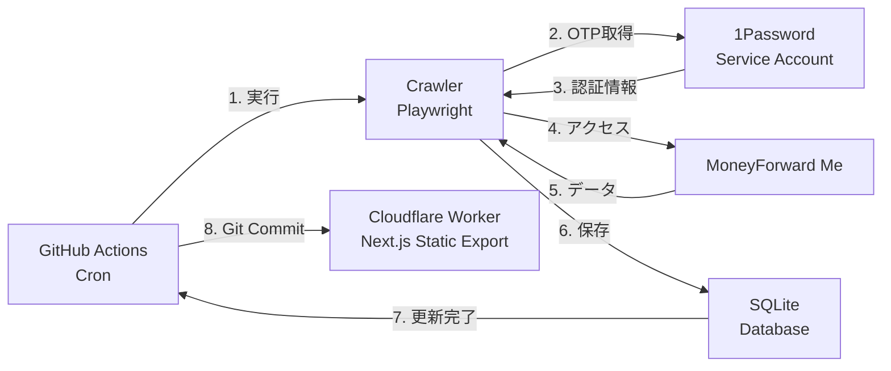
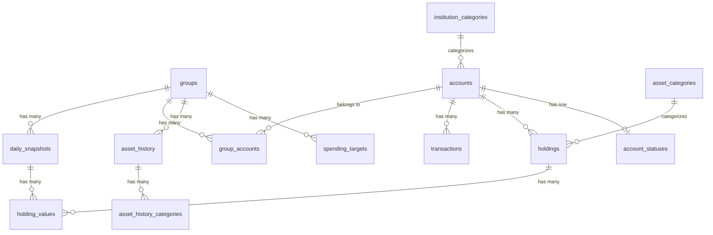

# MoneyForward Me Dashboard 仕様書

## 概要

MoneyForward Me Dashboard は、MoneyForward Me からデータを自動取得し、SQLite データベースに保存、静的サイトとして可視化を行うためのシステムです。GitHub Actions による定期実行と Cloudflare Pages によるホスティングを組み合わせ、完全に自動化された家計管理ダッシュボードを提供します。

---

## 目次

1. [主要機能](#主要機能)
2. [アーキテクチャ](#アーキテクチャ)
3. [プロジェクト構成](#プロジェクト構成)
4. [パッケージ詳細](#パッケージ詳細)
5. [データベーススキーマ](#データベーススキーマ)
6. [スクレイピング処理](#スクレイピング処理)
7. [Web ダッシュボード](#web-ダッシュボード)
8. [GitHub Actions](#github-actions)
9. [環境変数・設定](#環境変数設定)
10. [開発ガイドライン](#開発ガイドライン)
11. [セキュリティ](#セキュリティ)

---

## 主要機能

### 1. 定期自動更新

- GitHub Actions の cron スケジュールで毎日 2 回自動実行（JST 6:50 および 15:20）
- MoneyForward Me の「一括更新」ボタンを自動クリックし、全登録金融機関のデータを更新
- 1Password Service Account を利用したセキュアな認証情報管理

### 2. Slack 通知

- 更新結果を Slack チャンネルに自動投稿
- 前日との差分情報を含む

### 3. カスタムフック

- スクレイピング時に任意の処理を実行可能
- Playwright の `Page` オブジェクトを利用した柔軟なカスタマイズ

### 4. データ可視化

- 資産推移グラフ
- 収支内訳（カテゴリ別）
- ポートフォリオ分析
- 口座別資産状況
- キャッシュフロー分析
- バランスシート表示

---

## アーキテクチャ



### 処理の流れ

1. **定期実行**: GitHub Actions の cron スケジュールで自動実行
2. **認証**: 1Password Service Account から OTP を取得
3. **データ取得**: Playwright を使用して MoneyForward Me からデータをスクレイピング
4. **データ保存**: SQLite データベースに構造化して保存
5. **コミット**: SQLite ファイルをリポジトリにコミット
6. **ビルド・デプロイ**: Cloudflare Pages で Next.js の静的サイトをビルドして公開

---

## プロジェクト構成

本プロジェクトは pnpm workspaces + Turborepo によるモノレポ構成です。

```
mf-dashboard/
├── apps/
│   ├── crawler/          # MoneyForward スクレイパー
│   └── web/              # Next.js ダッシュボード
├── packages/
│   ├── db/               # データベーススキーマ & リポジトリ
│   ├── db-e2e/           # DB E2E テスト
│   └── meta/             # カテゴリ定義 & URL
├── data/
│   ├── moneyforward.db   # 本番データベース
│   └── demo.db           # デモ用データベース
├── docs/
│   ├── setup.md          # セットアップガイド
│   └── architecture/     # アーキテクチャドキュメント
└── .github/
    └── workflows/        # GitHub Actions ワークフロー
```

---

## パッケージ詳細

### apps/crawler

MoneyForward Me からデータをスクレイピングするパッケージ。

**主要依存関係:**

- `playwright`: ブラウザ自動化
- `@1password/sdk`: 1Password 連携
- `@slack/web-api`: Slack 通知
- `drizzle-orm` / `better-sqlite3`: DB 操作

**ディレクトリ構成:**

```
apps/crawler/src/
├── index.ts              # エントリーポイント
├── scraper.ts            # メインスクレイピングロジック
├── logger.ts             # ロギングユーティリティ
├── auth/                 # 認証関連
│   ├── login.ts          # ログイン処理
│   └── state.ts          # 認証状態管理
├── scrapers/             # 各ページのスクレイパー
│   ├── asset-history.ts
│   ├── asset-items.ts
│   ├── asset-summary.ts
│   ├── cash-flow.ts
│   ├── group.ts
│   ├── liabilities.ts
│   ├── portfolio.ts
│   ├── refresh.ts
│   └── ...
├── hooks/                # カスタムフック
└── slack.ts              # Slack 通知
```

**スクリプト:**

| コマンド     | 説明                             |
| ------------ | -------------------------------- |
| `start`      | 本番スクレイピング実行           |
| `dev:scrape` | デバッグモードでスクレイピング   |
| `test`       | ユニットテスト実行               |
| `test:e2e`   | E2E テスト実行                   |

---

### apps/web

Next.js 16 ベースの静的サイトダッシュボード。

**主要依存関係:**

- `next`: Next.js 16
- `react` / `react-dom`: React 19
- `recharts`: チャートライブラリ
- `@nivo/sankey`: Sankey ダイアグラム
- `tailwindcss`: スタイリング
- `lucide-react`: アイコン

**ディレクトリ構成:**

```
apps/web/src/
├── app/                  # Next.js App Router
│   ├── [groupId]/        # グループ別ページ
│   ├── accounts/         # 口座ページ
│   ├── bs/               # バランスシートページ
│   ├── cf/               # キャッシュフローページ
│   ├── layout.tsx
│   └── page.tsx
├── components/
│   ├── charts/           # チャートコンポーネント（純粋UI）
│   ├── info/             # 情報表示コンポーネント（データ取得）
│   ├── layout/           # レイアウトコンポーネント
│   └── ui/               # UI プリミティブ
└── lib/                  # ユーティリティ
```

**スクリプト:**

| コマンド         | 説明                         |
| ---------------- | ---------------------------- |
| `dev`            | 開発サーバー起動             |
| `dev:demo`       | デモデータで開発サーバー起動 |
| `build`          | 本番ビルド                   |
| `storybook`      | Storybook 起動               |
| `test:unit`      | ユニットテスト               |
| `test:storybook` | Storybook テスト             |
| `test:e2e`       | E2E テスト                   |

---

### packages/db

データベーススキーマとリポジトリ層を提供する共有パッケージ。

**主要ファイル:**

```
packages/db/src/
├── index.ts              # エクスポート
├── schema/
│   └── schema.ts         # Drizzle ORM スキーマ定義
├── repositories/         # データ操作リポジトリ
│   ├── accounts.ts
│   ├── groups.ts
│   ├── holdings.ts
│   ├── transactions.ts
│   ├── save-scraped-data.ts
│   └── ...
├── queries/              # クエリモジュール
│   ├── account.ts
│   ├── asset.ts
│   ├── holding.ts
│   ├── summary.ts
│   ├── transaction.ts
│   └── ...
└── shared/               # 共有ユーティリティ
```

---

### packages/meta

カテゴリ定義と URL 定数を提供する共有パッケージ。

**主要ファイル:**

- `categories.ts`: 収入/支出カテゴリ定義
- `urls.ts`: MoneyForward の URL 定数
- `groups.ts`: グループ関連定数

**カテゴリ定義:**

| 種別     | カテゴリ例                                               |
| -------- | -------------------------------------------------------- |
| 収入     | 未分類、収入                                             |
| 支出     | 食費、住宅、水道・光熱費、通信費、交通費、趣味・娯楽 等  |
| 資産     | 預金・現金・暗号資産、株式(現物)、投資信託、保険、年金 等 |

---

## データベーススキーマ

SQLite データベースで以下のテーブルを管理。

### テーブル一覧

| カテゴリ       | テーブル名                 | 説明                       |
| -------------- | -------------------------- | -------------------------- |
| マスタ系       | `groups`                   | グループ（資産グループ）   |
|                | `group_accounts`           | グループ-アカウント関連    |
|                | `institution_categories`   | 金融機関カテゴリ           |
|                | `accounts`                 | 口座（金融機関）           |
|                | `asset_categories`         | 資産カテゴリ               |
| ステータス系   | `account_statuses`         | 口座更新ステータス         |
| 銘柄・資産     | `holdings`                 | 銘柄マスタ（資産・負債）   |
| スナップショット | `daily_snapshots`        | 日次スナップショット       |
|                | `holding_values`           | 銘柄の日次評価額           |
| 収支系         | `transactions`             | 取引明細                   |
| 資産履歴系     | `asset_history`            | 資産推移履歴               |
|                | `asset_history_categories` | 資産推移カテゴリ別         |
| 予算系         | `spending_targets`         | 支出目標（予算）           |

### ER図



### 主要フィールド

**accounts テーブル:**

| フィールド   | 型      | 説明                   |
| ------------ | ------- | ---------------------- |
| id           | INTEGER | 主キー                 |
| mfId         | TEXT    | MoneyForward ID        |
| name         | TEXT    | 口座名                 |
| type         | TEXT    | "自動連携" / "手動"    |
| institution  | TEXT    | 金融機関名             |
| isActive     | BOOLEAN | 有効フラグ             |

**transactions テーブル:**

| フィールド     | 型      | 説明                           |
| -------------- | ------- | ------------------------------ |
| id             | INTEGER | 主キー                         |
| mfId           | TEXT    | MoneyForward ID                |
| date           | TEXT    | 取引日                         |
| category       | TEXT    | 大項目                         |
| subCategory    | TEXT    | 中項目                         |
| amount         | INTEGER | 金額                           |
| type           | TEXT    | "income" / "expense" / "transfer" |
| isTransfer     | BOOLEAN | 振替フラグ                     |

---

## スクレイピング処理

### 2フェーズ構成

スクレイピングは 2 フェーズで実行されます。

**Phase 1: グローバルデータ取得（グループ選択なし）**

- 一括更新（refresh）
- 全アカウント情報
- ポートフォリオ
- 負債情報
- キャッシュフロー

**Phase 2: グループ別データ取得**

- グループのアカウント一覧
- 資産履歴
- 支出目標
- 資産サマリー
- 資産項目

### スクレイピングモード

データベースの存在により自動判定されます。

| 条件             | モード    | 動作                   |
| ---------------- | --------- | ---------------------- |
| DB が存在する    | `month`   | 当月のみ取得           |
| DB が存在しない  | `history` | 過去 13 ヶ月分を取得   |

### 振替ロジック

振替の収支計算は以下のルールに従います。

- **収入としてカウント**: グループ内→グループ外への振替
- **支出としてカウント**: グループ外→グループ内への振替
- **内部振替（除外）**: グループ内→グループ内への振替

詳細は [docs/architecture/transfer-logic.md](./architecture/transfer-logic.md) を参照。

---

## Web ダッシュボード

### ページ構成

| パス              | 説明                     |
| ----------------- | ------------------------ |
| `/`               | トップページ（リダイレクト） |
| `/[groupId]`      | グループ別ダッシュボード |
| `/accounts`       | 口座一覧                 |
| `/bs`             | バランスシート           |
| `/cf`             | キャッシュフロー         |

### コンポーネント設計

| ディレクトリ | 役割                                     |
| ------------ | ---------------------------------------- |
| `charts/`    | 純粋な UI コンポーネント（チャート）     |
| `info/`      | Server Component（データ取得 + 表示）   |
| `layout/`    | レイアウトコンポーネント                 |
| `ui/`        | UI プリミティブ（ボタン、カード等）      |

### セマンティックカラー

金額表示には以下の CSS クラスを使用。

| 用途       | クラス名                |
| ---------- | ----------------------- |
| 収入金額   | `text-income`           |
| 支出金額   | `text-expense`          |
| 正の残高   | `text-balance-positive` |
| 負の残高   | `text-balance-negative` |

---

## GitHub Actions

### ワークフロー一覧

| ファイル名          | 説明                       |
| ------------------- | -------------------------- |
| `daily-update.yml`  | 日次自動更新               |
| `ci.yml`            | CI（テスト・リント）       |
| `deploy-demo.yml`   | デモサイトデプロイ         |
| `e2e-crawler.yml`   | クローラー E2E テスト      |

### daily-update.yml

```yaml
schedule:
  # JST 6:50
  - cron: "50 21 * * *"
  # JST 15:20
  - cron: "20 6 * * *"
```

**処理内容:**

1. 環境をセットアップ
2. 認証状態をキャッシュから復元
3. クローラーを実行
4. 認証状態をキャッシュに保存
5. データベースを Git コミット & プッシュ

---

## 環境変数・設定

### GitHub Actions Variables

| キー              | 必須 | 説明                         |
| ----------------- | ---- | ---------------------------- |
| `RUN_TASK`        | ✅   | `true` で crontab 実行を有効化 |
| `CACHE_AUTH_STATE`|      | 認証状態のキャッシュ         |

### GitHub Actions Secrets

| キー                       | 必須 | 説明                           |
| -------------------------- | ---- | ------------------------------ |
| `OP_SERVICE_ACCOUNT_TOKEN` | ✅   | 1Password サービスアカウントトークン |
| `OP_VAULT`                 | ✅   | 保管庫 ID                      |
| `OP_ITEM`                  | ✅   | MoneyForward アイテム ID       |
| `OP_TOTP_FIELD`            | ✅   | OTP フィールド ID              |
| `SLACK_BOT_TOKEN`          |      | Slack Bot トークン             |
| `SLACK_CHANNEL_ID`         |      | Slack チャンネル ID            |
| `DASHBOARD_URL`            |      | デプロイ先 URL                 |

### ローカル開発用 (.env)

```bash
OP_SERVICE_ACCOUNT_TOKEN=xxx
OP_VAULT=xxx
OP_ITEM=xxx
OP_TOTP_FIELD=xxx
```

---

## 開発ガイドライン

### パッケージマネージャー

- **pnpm を使用**（npm や yarn は使用しない）

```bash
# 依存関係追加
pnpm --filter <package> add <dep>

# 全パッケージインストール
pnpm install
```

### 開発コマンド

```bash
# デモデータで開発
pnpm dev:demo

# 実データで開発
pnpm db:dev  # スクレイピング実行
pnpm dev     # 開発サーバー起動

# テスト
pnpm test

# 型チェック
pnpm turbo typecheck

# リント
pnpm lint

# フォーマット
pnpm format
```

### 必須ルール

1. **DB スキーマ**: 全テーブルに `createdAt`, `updatedAt` 必須
2. **コンポーネント**: `components/` 配下は `*.stories.tsx` 必須
3. **テスト**: 新規ロジックにはユニットテスト必須
4. **インポート**: barrel ファイル（`index.ts`）禁止
5. **個人情報**: テストデータに個人情報は絶対に含めない

### ログレベル（クローラー）

| 関数      | ローカル | CI | 用途                   |
| --------- | -------- | -- | ---------------------- |
| `info()`  | ✅       | ✅ | 重要な進捗情報         |
| `log()`   | ✅       | ❌ | 詳細なデバッグ情報     |
| `debug()` | ⚙️       | ❌ | デバッグモード限定     |
| `warn()`  | ✅       | ✅ | 警告                   |
| `error()` | ✅       | ✅ | エラー                 |

---

## セキュリティ

### 推奨設定

| サービス          | 推奨設定                     |
| ----------------- | ---------------------------- |
| GitHub            | Passkey                      |
| MoneyForward Me   | ワンタイムパスワード         |
| Cloudflare        | Cloudflare One でアクセス制限 |

### 注意事項

- **プライベートリポジトリで運用**（SQLite にデータが含まれるため）
- Passkey のみだとクローリング時にログインできないため、OTP 設定必須
- Cloudflare Pages のプレビュー URL は無効化推奨

---

## 参考リンク

- [デモページ](https://hiroppy.github.io/mf-dashboard/accounts/)
- [UI コンポーネント集（Storybook）](https://hiroppy.github.io/mf-dashboard/storybook/)
- [セットアップガイド](./setup.md)
- [データベーススキーマ詳細](./architecture/database-schema.md)
- [振替ロジック詳細](./architecture/transfer-logic.md)
